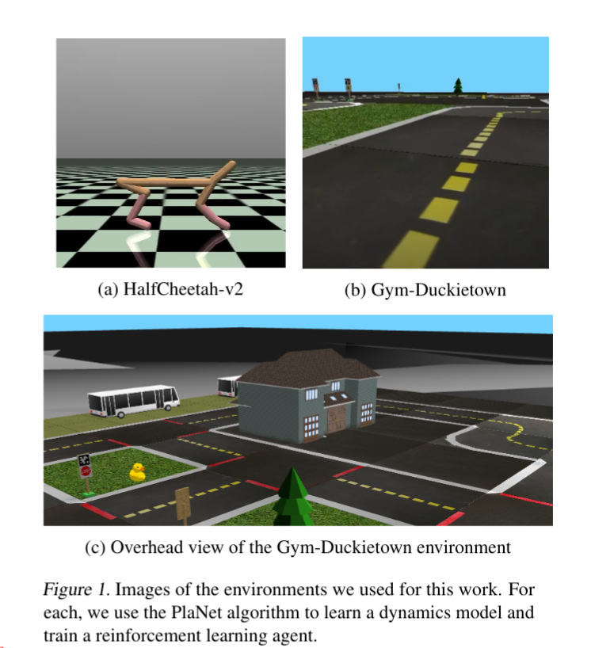
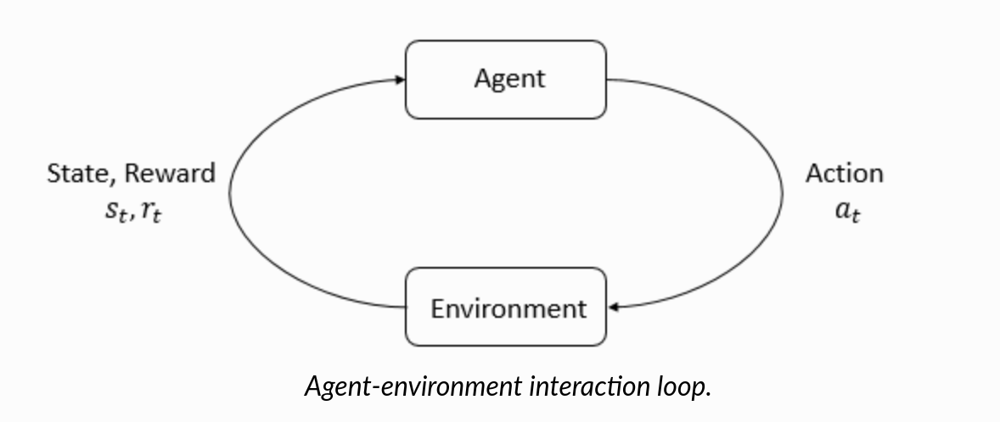

<!-- MathJax -->
<script type="text/javascript"
  src="https://cdnjs.cloudflare.com/ajax/libs/mathjax/2.7.3/MathJax.js?config=TeX-AMS-MML_HTMLorMML">
</script>

___

**Authors:** [Ali Kuwajerwala](https://alik-git.github.io/), [Paul Crouther](https://www.linkedin.com/in/paul-crouther-47221b52/) <br /> 
**Affiliation:** [Université de Montréal](https://diro.umontreal.ca/accueil/), [Mila](https://mila.quebec/en/) <br />
**Date Published:** April 28, 2022

___

_If you'd like to contribute to this page, you can do so via a [pull request](https://docs.github.com/en/pull-requests/collaborating-with-pull-requests/proposing-changes-to-your-work-with-pull-requests/creating-a-pull-request) through our [github repo](https://github.com/alik-git/duckietown-mbrl-lib), just edit the [index.md file](https://github.com/alik-git/duckietown-mbrl-lib/blob/gh-pages/index.md) on the [gh-pages branch](https://github.com/alik-git/duckietown-mbrl-lib/tree/gh-pages)._

___


**Abstract**

Model-based reinforcement learning (MBRL) algorithms have various sub-components that each need to be carefully selected and tuned, which makes it difficult to quickly apply existing models/approaches to new tasks. In this work, we aim to integrate the Dreamer algoithm into an existing popular MBRL toolbox, and tune the Dreamer-v1 and PlaNet algorithms to the Gym-Duckietown environment. We also provide trained models and code to to use as a baseline for further development. Additionally, we propose an improved reward function for RL training in Gym-Duckietown, with code to allow easy analysis and evaluation of RL models and reward functions.

- [1. Introduction](#1-introduction)
- [2. Related Work](#2-related-work)
  - [2.1. Model Based vs Model Free RL](#21-model-based-vs-model-free-rl)
  - [2.2. MBRL-Lib](#22-mbrl-lib)
  - [2.3. Gym-Duckietown](#23-gym-duckietown)
  - [2.4. Dream to Control (Dreamer)](#24-dream-to-control-dreamer)
- [3. Background](#3-background)
  - [3.1. Reinforcement Learning](#31-reinforcement-learning)
  - [3.2. Model-Based Reinforcement Learning](#32-model-based-reinforcement-learning)
  - [3.3. PlaNet for Gym-Duckietown](#33-planet-for-gym-duckietown)
- [4. Project Method](#4-project-method)
  - [4.1. Duckietown Reward function](#41-duckietown-reward-function)
  - [4.2. Dreamer](#42-dreamer)
  - [4.3. Dreamer training](#43-dreamer-training)
  - [4.4. Dreamer optimization](#44-dreamer-optimization)
  - [4.5. Dreamer evaluation](#45-dreamer-evaluation)
- [5. New skills we learned](#5-new-skills-we-learned)
  - [5.1. What we learned with Dreamer](#51-what-we-learned-with-dreamer)
  - [5.2. What we learned about driving and Duckietown](#52-what-we-learned-about-driving-and-duckietown)
  - [5.3. Using a pre-built library to start with](#53-using-a-pre-built-library-to-start-with)
  - [5.4. What we learned about logging and organization](#54-what-we-learned-about-logging-and-organization)
- [6. Experiments and Analysis](#6-experiments-and-analysis)
  - [6.1. Results:](#61-results)
- [7. Video Results](#7-video-results)
  - [7.1. PlaNet learning how to turn (almost):](#71-planet-learning-how-to-turn-almost)
  - [7.2. PlaNet learning to drive backward:](#72-planet-learning-to-drive-backward)
  - [7.3. Planet learning to jitter for speed reward:](#73-planet-learning-to-jitter-for-speed-reward)
  - [7.4. Dreamer learning to model Duckietown:](#74-dreamer-learning-to-model-duckietown)
  - [7.5. Dreamer trying to do ... something in Duckietown:](#75-dreamer-trying-to-do--something-in-duckietown)
  - [7.6. Dreamer learning to model Cheetah in Mujoco:](#76-dreamer-learning-to-model-cheetah-in-mujoco)
- [8. Conclusions](#8-conclusions)
- [9. Work Division](#9-work-division)
- [10. Acknowledgments](#10-acknowledgments)
- [11. References](#11-references)


## 1. Introduction 


    1 [4 pts] Project Introduction (2 paragraphs, with a figure)
    Tell your readers why this project is interesting. What we can learn. Why it is an important area for robot learning.

This project is interesting because we would like to have robots perform difficult tasks within large environments with complex dynamics. MBRL is still very difficult for such tasks since the learned world model must accurately represent and make predictions about the environment. Model free (MF) approaches can perform better on such tasks, but they typically require an amount of interaction with the environment that is very inefficient when compared to MB approaches. 

Therefore, improving MBRL approaches to outperform MF approaches for tough  environments would make it easier to develop robot solutions for the tasks we care about, since the barrier to entry posed by the inefficient sample complexity would be eliminated. Additionally, the best learned world models could be reused for a variety of tasks. 

In this work we attempt to use two MBRL algorithms, Dreamer-v1 and PlaNet, to learn a world model for the Gym-Duckietown environment, which we then use to train a lane-following policy. The Gym-Duckietown environment is significantly larger and more complex than environments included in the aforementioned algorithms' respective papers. We also provide the code we used, where we place a strong emphasis on documentation and modularity, so that more MBRL approaches can be applied to Gym-Duckietown, where our Dreamer-v1 and PlaNet can serve as comparative baselines. This helps us move toward our goal of getting robots to perform the kinds of difficult tasks we care about.



##  2. Related Work

    2 [2 pts] What is the related work? Provide references:(1-2 paragraph(s))
    Give a description of the most related work. How is your work similar or different from the most related work?


<!-- ### RL, MBRL, PlaNet, what we can improve on PlaNet
*Dreamer is different because it uses PlaNet as a world model, and gets value estimates with respect to the world model, and then takes actions with respect to those estimates -->

### 2.1. Model Based vs Model Free RL

Reinforcement learning is an active field of research in autonomous vehicles. Model-based approaches are used less frequently than model-free approaches since model-free approaches have had better performance in the past and as a result it is easier to find existing implementations. 

The largest advantage that model based approaches offer is their superior sample complexity. That is, model based approaches can use orders of magnitude less data or interaction with the external environment compared to model-free methods. This is because model based methods can train the policy on the internal model of the environment as opposed to the external environment itself. Additionally, another advantage that model-based methods have is that the learned model of the environment can be task agnostic, meaning that it can be used for any task that requires predicting the state of the environment in the future.


### 2.2. MBRL-Lib

There are many available open source implementations of popular model-free approaches [OpenAI Baselines](https://github.com/openai/baselines) [PyTorchRL](https://modelzoo.co/model/pytorch-rl) and model-based approaches [Baconian MBRL](https://arxiv.org/pdf/1904.10762.pdf). During our review, we found the MBRL-Lib toolbox [MBRL-lib](https://arxiv.org/pdf/2104.10159.pdf) to be most useful. 

MBRL-Lib contains implementations of various popular model-based approaches, but more importantly it is designed to be modular and compatible with a wide array of environments; and makes heavy use of configuration files to minimize the amount of new code needed to tweak an existing approach. Integrating the Gym-Duckietown environment to work with this toolkit would allow users to easily experiment with and evaluate a variety of model based RL approaches in the Duckietown simulation.

### 2.3. Gym-Duckietown


Gym-Duckietown, a self-driving car simulator for the Duckietown universe already built as an OpenAI Gym environment is the ideal  candidate to make available for use with the model-based approaches provided by MBRL-Lib along with Dreamer.

Gym-Duckietown is different from most environments previously used by model-based approaches. It has significantly more complex dynamics than the standard OpenAI Gym environments. Consider for example that the Cheetah environment only consists of one (albeit complex) object in a plain background with the camera always tracking it. Compared to Gym-Duckietown, where the camera is fixed on the car which moves through the scene, drastically changing the objects found in different observations.
Our results indicate that while MBRL methods have the potential to perform well in Gym-Duckietown, they need to be carefully tuned and modified to achieve results comparable to those of the current baselines.

### 2.4. Dream to Control (Dreamer)

To observe how Duckietown scales with different and more performant MBRL algorithms and to facilitate learning, one of the goals in this project is to develop an implementation of [Dreamer](https://arxiv.org/pdf/1912.01603.pdf), which does not exist in MBRL-Lib. Similar to PlaNet, Dreamer uses a recurrent state space model (RSSM) to represent the underlying MDP with partial observability by using PlaNet as a world model. Where it differs from PlaNet is in the model fitting section and the lack of a planning section. With Dreamer, the model fitting part is broken into a dynamics learning section and a behavior learning section which does rollouts of imagined trajectories, and finally updates parameters for the action model, and value model using gradients of value estimates of imagined states for the learning objective. Since these trajectories are imagined, the authors utilize reparameterization for continuous actions and states. Lastly, Dreamer computes the state from history during the environment interaction step, with noise added to the action for exploration.

In the paper, the authors run Dreamer on the DeepMind control suite, similar to PlaNet. However, since the original implementation is in TensorFlow, it will need to be re-implemented in PyTorch for direct comparison to other algorithms in MBRL-Lib.

## 3. Background

    3 [2 pts] What background/math framework have you
    used? Provide references: (2-3 paragraph(s) + some math)
    Describe what methods you are building your work on. 
    Are you using RL, reset-free, hardware, learning from images? 
    You want to provide enough information for the average student in the class to understand the background.


### 3.1. Reinforcement Learning



[_From Spinning Up RL_](https://spinningup.openai.com/en/latest/spinningup/rl_intro.html): The main characters of RL are the agent and the environment. The environment is the world that the agent lives in and interacts with. At every step of interaction, the agent sees a (possibly partial) observation of the state of the world, and then decides on an action to take. The environment changes when the agent acts on it, but may also change on its own.


### 3.2. Model-Based Reinforcement Learning

To setup the reinforcement learning problem from a model-based reinforcement learning (MBRL) perspective, we adhere to the Markov decision process formulation [MDP Bellman](https://apps.dtic.mil/sti/pdfs/AD0606367.pdf), where we use state $$s \in \mathcal{S}$$ and actions $$a \in \mathcal{A}$$ with reward function $$r(s,a)$$ and the dynamics or transition function $$f_\theta$$, such that $$s_{t+1} = f_{\theta}(s_t, a_t)$$ for deterministic transitions, and stochastic transitions are given by the conditional $$f_\theta(s_{t+1}\mid s_t, a_t) = \mathbb{P}(s_{t+1}\mid s_t, a_t, ; \theta)$$ and learning the forward dynamics is akin to doing a fitting of approximation $$\hat{f}$$ to the real dynamics $$f$$ given real data from the system.

### 3.3. PlaNet for Gym-Duckietown

Of the important contributions of [PlaNet](https://arxiv.org/pdf/1811.04551.pdf), one of them is the recurrent state space model (RSSM). The RSSM has both stochastic and deterministic components and it was shown in PlaNet to greatly improve results compared to purely stochastic or deterministic models on complicated task.
To bring the input images to the latent space, we need an encoder. Since we are using images, a convolution neural net is perfect for the task.
No-policy is actually trained since the planning algorithm use only the models to choose the next best action.

Since the models are using stochastic decisions, the training is using a variational bound to optimise its parameters. It alternatively optimises the encoder model and the dynamics model by gradient ascent over the following variational bound:

$$\ln{p}(o_{1:T}  \mid a_{1:T}) = \ln \int \prod_t p(s_t\mid s_{t-1},a_{t-1})p(o_t\mid s_t)ds_{1:T} \\ \geq \sum_{t=1}^{T}  \bigg( \mathbb{E}_{q(s_t\mid o_{\leq t},a_{\leq t})}[\ln{p(o_t\mid s_t)}])  - \\
\mathbb{E}_{q(s_{t-1}\mid o_{\leq t-1},a_{\leq t-1})}[KL[q(s_{t}\mid o_{\leq t},a_{\leq t})\mid \mid  p(s_t\mid s_{t-1},a_{t-1})]] \bigg)$$

The PlaNet models follow a Partially Observable Markov Decision Process(POMDP). It is built on a finite sets of: states($$s_t$$), actions($$a_t$$) and observations($$o_t$$).

* Dynamics model : $$s_t \sim p(s_t \mid s_{t-1},a_{t-1})$$
* Encoder : $$s_t \sim q(s_t \mid o_{\leq t},a_{\leq t})$$
* Decoder : $$o_t \sim p(o_t \mid s_{t},a_{t-1})$$
* Reward : $$r_t \sim p(r_t \mid s_t)$$
* Discount : $$ \gamma \in [0,1]$$

The rest of the details are outlined for the RSSM representation in comparsion to deterministic and stochastic models is outlined in the paper.

##  4. Project Method

    4 [6 pts] Project Method, How will the method work (1-2 pages + figure(s) + math + algorithm)
    Describe your method. 
    Again, You want to provide enough information for the average student in the class to understand how your method works. 
    Make sure to include figures, math, or algorithms to help people understand.


### 4.1. Duckietown Reward function

The reward function in Duckietown is as follows (comments added by me):

```python
reward = (
        +1.0 * speed * lp.dot_dir + # Speed Reward
        -10 * np.abs(lp.dist) + # Stay in center of lane reward
        +40 * col_penalty # Big penalty for collision 
)
```

I tried various tweaks to the reward function, with the only marginal improvement coming from replacing the "speed reward" with a "distance traveled" reward. This slightly reduced the jitter in the learned behavior.

```python
reward = (
        # +1.0 * speed * lp.dot_dir + # Speed Reward
        -10 * np.abs(lp.dist) + # Stay in center of lane reward
        +40 * col_penalty # Big penalty for collision 
)
# Ali's reward:
delta_pos = self.cur_pos - self.cur_poses[0]
distance_traveled = np.linalg.norm(delta_pos)
reward += distance_traveled*50
```
It was quite time consuming to try to fix the reward function as you can't use the reward as a metric anymore. A "high reward" doesn't exactly mean your model is learning more intelligent behavior. Evaluating the reward function meant running a few experiments after each change and qualitatively observing the behavior of the policy.

### 4.2. Dreamer

Given that the MBRL-lib only includes PlaNet and not Dreamer, we can take advantage of the fact that Dreamer is heavily inspired from PlaNet for our Dreamer implementation. For example the "model" in PlaNet, the recurrent state model can be used as the learned world model for Dreamer. Similarly, in departure from PlaNet, rather than a CEM for the best action sequence under the model for planning, Dreamer uses a dense action network parameterized by phi and the dense value network parameterized by psi, so these components can be "added" to the basic PlaNet structure.

<!-- Given that the MBRL-lib does not include a Dreamer implementation, but rather the PlaNet model, it makes sense to reuse the recurrent state model from the PlaNet implementation as a world model for Dreamer. However, there are structural components that are missing. For example,  -->

$$a_\tau = ActorNetwork_\phi(s_\tau) \sim q_\phi(a_\tau \mid s_\tau)  \\ v_\phi(s_\tau)  = DenseValueNetwork_\psi(s_\tau) \approx \mathbb{E}_{q(\cdot \mid s_\tau)} \left( \sum_{\tau = t}^{t+H} \gamma^{\tau - t}r_\tau \right)$$

For the action model with imagined actions, the authors use a tanh-transformed Gaussian [SAC](https://arxiv.org/pdf/1801.01290.pdf) output for the action network, which provides a deterministically-dependent mean and variance of the state through a reparameterization [VAE1](https://arxiv.org/pdf/1312.6114.pdf) [VAE2](https://arxiv.org/pdf/1401.4082.pdf) of the stochastic node, adding noise $\epsilon$ back in afterwards (to be inferred).

$$a_\tau = \tanh(\mu_\phi(s_\tau) + \sigma_\phi(s_\tau) \epsilon), \qquad \epsilon \sim \mathcal{N}(0, \mathbb{I})$$

This formalizes the deterministic output of the action network returns a mean mu and we learn the variance of the noise sigma with this reparameterization, inferring from our normal noise epsilon, to represent our stochastic model.

$$\text{mean } = \mu_\phi(s_\tau), \\
\text{variance } = \sigma_\phi(s_\tau), \\
\text{noise } = \epsilon$$

Then the value network consists of imagined value estimates $$V_R(s_\tau) = \mathbb{E}(q_\theta q_\phi(\sum_{n=\tau}^{t+H} r_n))$$ which is the sum of rewards until the end of a horizon, then using values $$v_\psi(s_\tau)$$ then computes $$V^{k}_N(s_\tau) = \mathbb{E}(q_\theta q_\phi(\sum_{n=\tau}^{h = \min(\tau+k, t+H)-1} \gamma^{n-\tau}r_n + \gamma^{h-\tau} v_\psi(s_h)))$$ as a estimate of rewards beyond $k$ steps with the learned value model, and $$V_\lambda(s_\tau)$$ which is a exponentially weighted average of $$V^{k}_N(s_\tau)$$ at different values of k, shown in the following. 

$$V_\lambda(s_\tau) = (1 - \lambda)\sum_{n=1}^{H-1}\lambda^{n-1}V_{N}^{n}(s_\tau) + \lambda^{H-1}V_{N}^{H}(s_\tau)$$

This helps Dreamer do better with longer-term predictions of the world, over shortsightedness with other types of dynamics models for behavior learning. Since Dreamer disconnects the planning and action by training an actor and value network and uses analytic gradients and reparameterization, it is more efficient than PlaNet which searches the best actions among many predictions for different action sequences. This motivates the implementation of Dreamer to compare to PlaNet with potential performance improvements with a similar number of environment steps. The policy is trained via using the analytical gradient $$\nabla_\phi \mathbb{E}(q_\theta q_\phi(\sum_{n=\tau}^{t+H} V_\lambda(s_\tau))$$ from stochastic backpropagation, which in this case becomes a deterministic node where the action is returned, with the value network being updated with the gradient  $$\nabla_\psi \mathbb{E}(q_\theta q_\phi(\sum_{n=\tau}^{t+H} \frac{1}{2}\| v_\psi(s_\tau) - V_\lambda(s_\tau))\| ^2$$ after imagined value estimates are computed. All of this happens in the update steps for behavior and dynamics learning. Finally, in an environment interaction time step, the agent gets states from its history and returns actions from the action network, and value model estimates the imagined rewards that the action model gets in each state. These are trained cooperatively in a policy iteration fashion.

### 4.3. Dreamer training

For training the first version of the Dreamer prototype, we used the Cheetah environment to compare directly to the built-in library PlaNet implementation with an action noise of $$\epsilon = 0.3$$ like the original paper. The model, actor, and critic losses are logged from their respective networks. The losses, and their updates are described in more detail in the following sections. 

The model loss contains the reconstruction loss and represents the PlaNet world or dynamics model. The PlaNet world model is composed of an encoder and decoder, from a variational autoencoder (VAE) to transform the image inputs into latents, and then back to images. So, this encoder generates latents $$latents = encoder_\theta(img)$$ that get passed to the world model (RSSM) to get the posterior and prior with respect to latents and also an initial state and initial action shown as: $$s_0 = dynamics(img.shape, a_0)$$. The RSSM returns the posterior and prior by rolling out an RNN from a starting state through each index of an embedding input, or latent, and an action such that we receive $$posterior, prior = RSSM_\theta(latents, s_0, a_0)$$ from the dynamics model. We then get features from the posterior $$features = dynamics(posterior)$$and use that for the image prediction, reward prediction

$$pred_{rew} = DenseRewNet_\theta(features) \\ pred_{img} = decoder_\theta(features)$$

 from the reward model defined by a dense network. We use these networks for losses from the image and reward, shown here (using probabilities from a softmax):
 
 $$loss_{img} = -\frac{1}{N}\sum \log(prob(pred_{rew} (observation)) \\
loss_{rew} = -\frac{1}{N}\sum \log(prob(pred_{img} (rew))$$

and pass the prior distribution and posterior distribution to a KL divergence loss:
  
 $$loss_{KL} = -\frac{1}{N}\sum KL(posterior \| prior)$$ 

and finally combine image loss, reward loss, and KL loss with a KL coeff to get the overall model loss. 

$$loss_{model} = loss_{rew} + loss_{img} + loss_{KL} * KLdiv_{const}$$


First, we use the dynamics model to imagine ahead a few trajectories:

$$features_{imagined} = dynamics(s_\tau.detach(), imaginehorizon)$$

The actor loss is the loss from the actor network, which is described in the following, using the $$\lambda-return$$ which is such that: $$\text{fixed 1-step return if : } \lambda = 0 \text{, Monte Carlo return if: } \lambda = 1$$ 

Such that our reward model gives us:

$$rewards = \frac{1}{N}\sum DenseRewNet_\theta(features_{imagined})$$

$$values = \frac{1}{N}\sum ValueModel(features_{imagined})$$

$$returns_{\lambda} = (1 - \lambda)\sum_{n=1}^{H-1}\lambda^{n-1}rewards + \lambda^{H-1}values$$

Such that the actor loss is (where gamma is a the discount factor):

$$loss_{actor} = -\frac{1}{N}\sum \gamma * (returns_{\lambda})$$

and for the critic:

$$pred_{values} = ValueModel(features_{imagined}.detach()) \\
target = \text{stop-gradient}(returns_{\lambda})$$

$$loss_{critic} = -\frac{1}{N}\sum \gamma * \log(prob(pred_{values}(target)))$$

### 4.4. Dreamer optimization

Here, we use an Adam optimizer for each loss, so we end up with the following: 

$$Adam_{model} = opt(lr=\text{lr}_{model}) \\
Adam_{actor} = opt(lr=\text{lr}_{actor})\\
Adam_{critic} = opt(lr=\text{lr}_{critic})$$

Then we perform an `optimizer.step()` with all of them (Note: Doing this in MBRL-lib is more difficult than it should be!). We nested them all under a dreamer-update function, but diverged from the philosophy of the library to do so. MBRL-Lib casts the MBRL/RL problem as the dynamics being a standard model and supervised-learning style dynamics fitting as trajectory or optimization update. Given that Dreamer breaks apart the model learning, behavior learning, and environment interaction steps, this simplification leads to a training loop not being able to fully support Dreamer. To this end, we forced the Dreamer code into the dynamics model, and allowed the library to think it was performing a singular update when it was actually performing multiple updates. This means however that our implementation is a little crude, and there is potential for future projects where we redesign the Dreamer implementation to be more fitting with the original library.

### 4.5. Dreamer evaluation 
We run a test period of 3 episodes in most cases, sampling actions from the action model and passing them to the environment without any learning. In addition, to evaluate Dreamer, we return only the $$loss_{reward}, loss_{img}, loss_{KL}$$ .

## 5. New skills we learned

    5 [2 pts] What new skills have you(s) learned from this project?
    List some of the technical skills you are learning from studying this method.

### 5.1. What we learned with Dreamer

- Dreamer fundamentally different than other MBRL algorithms in the sense that there is also a policy being learned as opposed to just a world model.

- MBRL-Lib tries to think of MBRL approaches as models only, and uses a "universal" outer loop to train the models, with the details of each model being inside a "train" function for that model. Dreamer is not very well suited in practice to this approach and makes it the optimization of the 3 networks difficult. This made us learn about the general structure of RL algorithms and MBRL algorithms.

- Goal in mind was to do dreamer implementation that fits well with MBRL-Lib, potentially to submit a pull request to the library. But we decided to first get a prototype implementation done as a proof of concept that Dreamer can be trained using the env and training loop of the library.

### 5.2. What we learned about driving and Duckietown 

- The reward function was originally specified with negative rewards for driving on the wrong side of the road, which was found to be a compounding issue with random spawning. Frequently, the agent would spawn in locations with no way to obtain positive rewards, and the episode terminates when the agent goes off track. So, the agent would avoid the negative rewards from a bad spawning location and often go straight off-track. To stabilize learning, we implemented fixed spawn locations and the reward is now tuned reward distance traveled as opposed to speed. It was also discovered that there are multiple wrappers doing pre-processing on the observations for stacking, which means exporting these as "raw images" is not possible without unrolling all of the wrappers given the continuous control suites, making it difficult to save videos of policy behavior and evaluate learned policies outside of MBRL-Lib.

### 5.3. Using a pre-built library to start with

- Easy-to-use libraries might seem like less work to use for simple implementations, but complex algorithms or environments expect more flexibility than "easy" libraries provide.
  
- Also, using a library means committing to the creator's design philosophy for the project, which may not be suitable for new approaches, especially as the state of the art attempts to be more and more creative.

### 5.4. What we learned about logging and organization

- It's difficult to compare runs over the long-term, because no matter how meticulous your logging is, the fact that you learn new things about your approach and change your methods means that experiments you ran a while ago will have a different and outdated structure that is unfair to compare with newer runs.

- Using a proprietary tool to log your results means that they can prevent you from accessing them if you use too much of their bandwidth.

- It can be difficult to share your results, if people need an account with the proprietary tool to view them.

## 6. Experiments and Analysis

    6 [8 pts] Experiments and Analysis**
    In this section
    1. Describe what experiment(s) you are going to run and why? How do these show you have met your learning goals?
    2. What do you think the results of these experiments will be?
    3. Sketch out the figures that you will later generate from your work. Spend a few
    minutes drawing them out in GIMP or photoshop. Why will these be enough evidence
    for learning? Is anything missing?

    Keep in mind these experiments are for this course project. What is expected is that you
    should provide evidence that your method works and it has been coded up well. Provide
    evidence of this via your data and learning graphs. However, this should not be restricted
    to learning graphs.


### 6.1. Results:


<iframe src="https://wandb.ai/mbrl_ducky/MBRL_Duckyt/reports/Shared-panel-22-04-28-20-04-12--VmlldzoxOTE2MTQy?highlightShare" style="border:none;height:9200px;width:100%"> </iframe>

<!-- View only:

<iframe src="https://wandb.ai/mbrl_ducky/MBRL_Duckyt/reports/Results-and-stuff--VmlldzoxOTE2MTQy?accessToken=0yrkv2r1iuphg2g4fi6het7gsfeumyqmkn2r5fq63q3e7aiedbw6smpux1uiudpo" style="border:none;height:500px;width:100%"> </iframe> -->


## 7. Video Results 

    7 [2 pts] Video Results
    Include a link to a video of the method so far. 
    This is not intended to be a final performance video. 
    Provide something to help me give feedback on what I would do to improve this method or debug issues.


### 7.1. PlaNet learning how to turn (almost):

This run is evidence that PlaNet (although very sporadically) is trying to maximize reward by driving, and doing so by learning behavior that doesn't _just_ exploit the design of the reward function.

<iframe src="https://wandb.ai/mbrl_ducky/MBRL_Duckyt/reports/Shared-panel-22-04-28-19-04-83--VmlldzoxOTE2MDQz?highlightShare" style="border:none;height:850px;width:100%"> </iframe>

### 7.2. PlaNet learning to drive backward:

This run shows that PlaNet learned some unexpected behaviors by driving backwards to increase it's "distance traveled" as opposed to turning. This shows that the model is exploring the action space well towards maximizing reward.

<iframe src="https://wandb.ai/mbrl_ducky/MBRL_Duckyt/reports/Shared-panel-22-04-28-19-04-48--VmlldzoxOTE2MDUw?highlightShare" style="border:none;height:850px;width:100%"> </iframe>

### 7.3. Planet learning to jitter for speed reward:

This run shows that PlaNet learned some unexpected behaviors by moving back and forth in place to increase it's "speed" as opposed to turning. This shows that the model is exploring the action space well towards maximizing reward.

<iframe src="https://wandb.ai/mbrl_ducky/MBRL_Duckyt/reports/Shared-panel-22-04-28-19-04-53--VmlldzoxOTE2MDYw?highlightShare" style="border:none;height:850px;width:100%"> </iframe>


### 7.4. Dreamer learning to model Duckietown:

These reconstructions clearly show that the Dreamer world model is at the very least learning the appearance of the Duckietown environment, if not the dynamics of it. The reconstructions are a lot better than we expected. This shows that current model based have serious potential to achieve good performance for driving in Gym-Duckietown.


<iframe src="https://wandb.ai/mbrl_ducky/MBRL_Duckyt/reports/Shared-panel-22-04-28-19-04-57--VmlldzoxOTE1OTgz?highlightShare" style="border:none;height:850px;width:100%"> </iframe>

### 7.5. Dreamer trying to do ... something in Duckietown:

It is just here to show that learning didn't always occur, we had a lot, and we mean a lot of experiments that were just sporadic behavior.

<iframe src="https://wandb.ai/mbrl_ducky/MBRL_Duckyt/reports/Shared-panel-22-04-28-19-04-06--VmlldzoxOTE2MDc3?highlightShare" style="border:none;height:850px;width:100%"> </iframe>

### 7.6. Dreamer learning to model Cheetah in Mujoco:

These results are a baseline to compare against the Duckietown reconstructions.

<iframe src="https://wandb.ai/mbrl_ducky/MBRL_Duckyt/reports/Shared-panel-22-04-28-19-04-73--VmlldzoxOTE2MDgx?highlightShare" style="border:none;height:850px;width:100%"> </iframe> 


<!-- <div>
<iframe src="https://wandb.ai/mbrl_ducky/MBRL_Duckyt/reports/Shared-panel-22-04-28-19-04-57--VmlldzoxOTE1OTgz?highlightShare" style="border:none;height:400px;width:100%"> </iframe>
</div> -->


## 8. Conclusions

    8 [4 pts] Conclusions
    What have your results indicated?
    What have you learned? 
    What would you do differently next time? 
    Reflect on the scope of your project, was it too much? Why?


In this work we implemented the Dreamer algorithm for the MBRL-Lib library, and we applied MBRL approaches to the Gym-Duckietown environment. 

Our results indicate that there certainly is potential for model-based approaches to perform well in Gym-Duckietown, but there are certain barriers to overcome, mainly a better reward function is needed, and higher capacity models that plan much further into the future.

We learned a lot about how RL and MBRL algorithms are structured, how the distinction between model-based and model free can start to blur for algorithms like Dreamer. We learned how difficult it can be to design a reward function that enables learning to take place, and how long this process can take when each tiny modification requires hours of training to evaluate.

If we were to start over, we would ask for help earlier, lots of people know much more about Duckietown than we do and were very helpful, we imagine it is the same for MBRL-Lib, so we would have reached out to the authors earlier. 

Trying to fit in real robot experiments was definitely too much as both Gym-Duckietown and MBRL pose significant challenges to work with as it is. Finally, the amount of experiments needed to evaluate our work - since each RL run takes hours to learn on an environment like Duckietown - was out reach early on.


## 9. Work Division

    Provide a description on what each group member is working on as part of the project. 
    I recommend each student work on most of the parts of the project so everyone learns about the content.
    
Both members worked on all the parts.

Student Name: Ali focused more on infrastructure code for Gym-Duckietown (reward function tuning) and logging.

Student Name: Paul focused more on the Dreamer implementation.


## 10. Acknowledgments

Our code is based entirely within facebook research's [MBRL-Lib toolbox](https://github.com/facebookresearch/mbrl-lib). We also use their PlaNet implementation as is. 

The Dreamer algorithm was first presented by [Danijar Hafner](https://danijar.com/) and colleagues in the [Dream to Control paper](https://danijar.com/project/dreamer/).

For our project's implementation of Dreamer, we sourced a lot of code from Chandramouli Rajagopalan's [excellent pytorch implementation of Dreamer](https://github.com/chamorajg/pl-dreamer).

We used the [Duckietown environment](https://www.duckietown.org/platform) to evaluate our approach. Duckietown is a modular robotics and AI ecosystem, part of which is a driving simulation that's well suited for reinforcement learning.

## 11. References

We've included links to the original work whenever we've referenced something in this report, you should just be able to click the link and find what you need!


