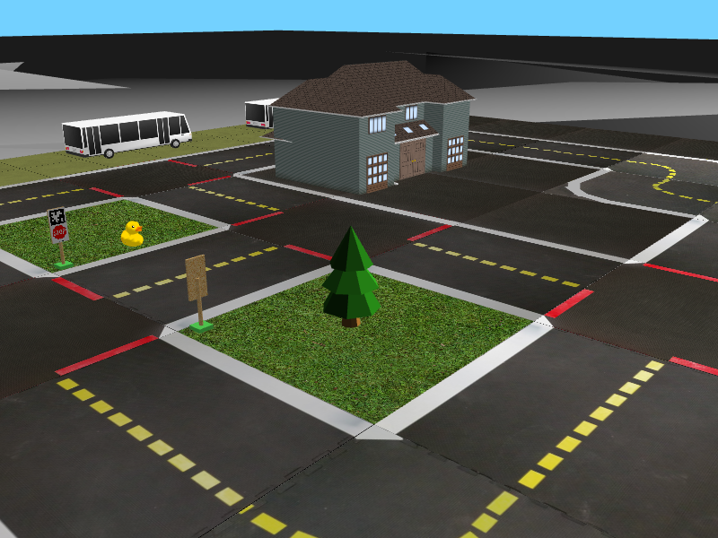

## Abstract 

Abstract is work in progress:
Model-based reinforcement learning (MBRL) algorithms have various sub-components that each need to be carefully selected and tuned, which makes it difficult to quickly apply existing models/approaches to new tasks. In this work, we aim to tune the Dreamer-v1 and PlaNet MBRL algorithms to the Gym-Duckietown environment \cite{dtown}, and provide trained models and code to to use as a baseline for further development. Additionally, we propose an improved reward function for RL training in \gd, and code to allow easy analysis and evaluation of RL models and reward functions.



## Introduction

See Abstract. This project is interesting because we would like to have robots perform difficult tasks within large environments with complex dynamics. MBRL is still very difficult for such tasks since the learned world model must accurately represent and make predictions about the environment. Model free (MF) approaches can perform better on such tasks, but they typically require an amount of interaction with the environment that is very inefficient when compared to MB approaches. 

Therefore, improving MBRL approaches to outperform MF approaches for tough environments would make it easier to develop robot solutions for the tasks we care about, since the barrier to entry posed by the inefficient sample complexity would be eliminated. Additionally, the best learned world models could be reused for a variety of tasks. 

In this work we attempt to use two MBRL algorithms, Dreamer-v1 and PlaNet, to learn a world model for the Gym-Duckietown environment, which we then use to train a lane-following policy. The Gym-Duckietown environment is significantly larger and more complex than environments included in the aforementioned algorithms' respective papers. We also provide the code we used, where we place a strong emphasis on documentation and modularity, so that more MBRL approaches can be applied to Gym-Duckietown, where our Dreamer-v1 and PlaNet can serve as comparative baselines. This helps us move toward our goal of getting robots to perform the kinds of difficult tasks we care about.

## 


You can use the [editor on GitHub](https://github.com/alik-git/duckietown-mbrl-lib/edit/gh-pages/index.md) to maintain and preview the content for your website in Markdown files.

Whenever you commit to this repository, GitHub Pages will run [Jekyll](https://jekyllrb.com/) to rebuild the pages in your site, from the content in your Markdown files.

### Markdown

Markdown is a lightweight and easy-to-use syntax for styling your writing. It includes conventions for

```markdown
Syntax highlighted code block

# Header 1
## Header 2
### Header 3

- Bulleted
- List

1. Numbered
2. List

**Bold** and _Italic_ and `Code` text

[Link](url) and 
```

For more details see [Basic writing and formatting syntax](https://docs.github.com/en/github/writing-on-github/getting-started-with-writing-and-formatting-on-github/basic-writing-and-formatting-syntax).

### Jekyll Themes

Your Pages site will use the layout and styles from the Jekyll theme you have selected in your [repository settings](https://github.com/alik-git/duckietown-mbrl-lib/settings/pages). The name of this theme is saved in the Jekyll `_config.yml` configuration file.

### Support or Contact

Having trouble with Pages? Check out our [documentation](https://docs.github.com/categories/github-pages-basics/) or [contact support](https://support.github.com/contact) and we’ll help you sort it out.
